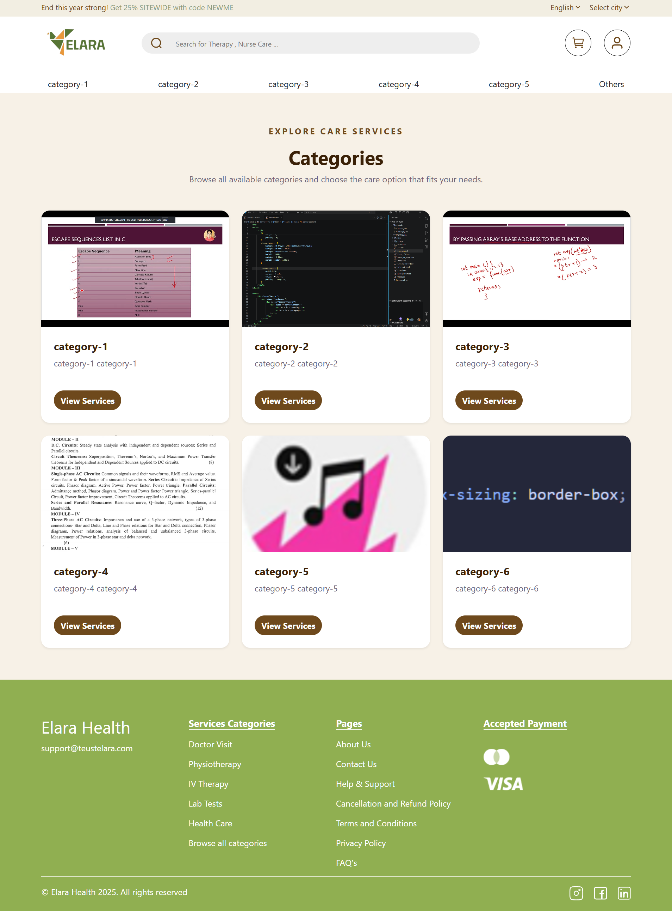
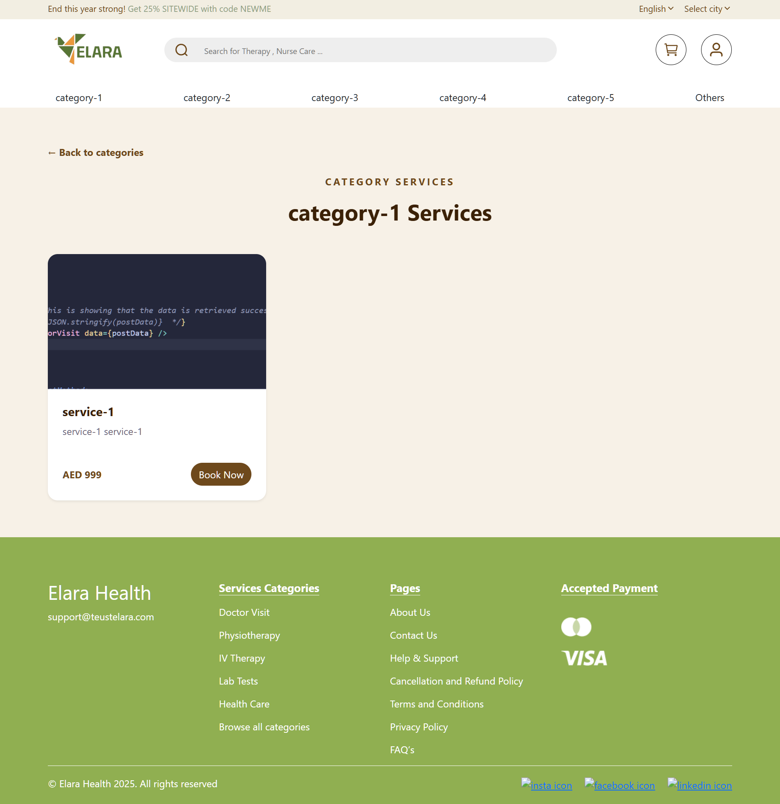
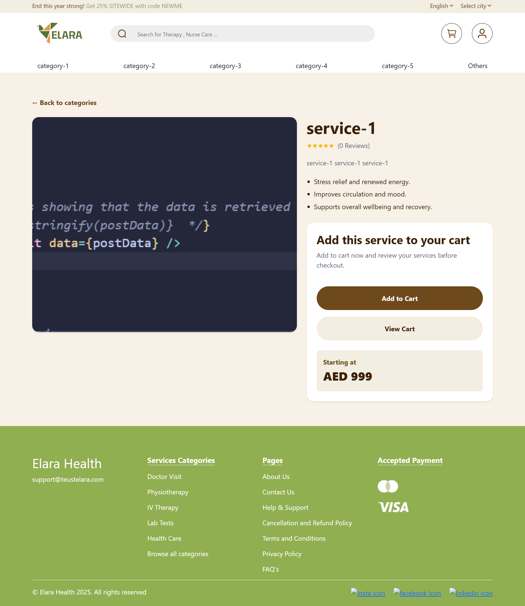
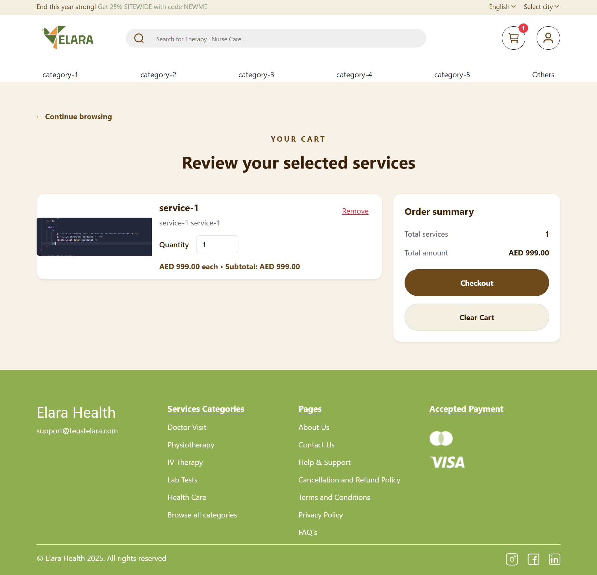
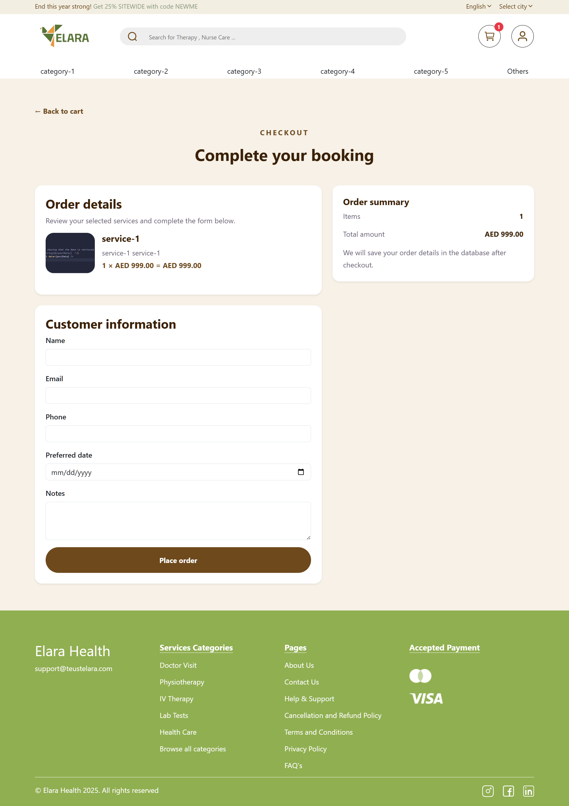
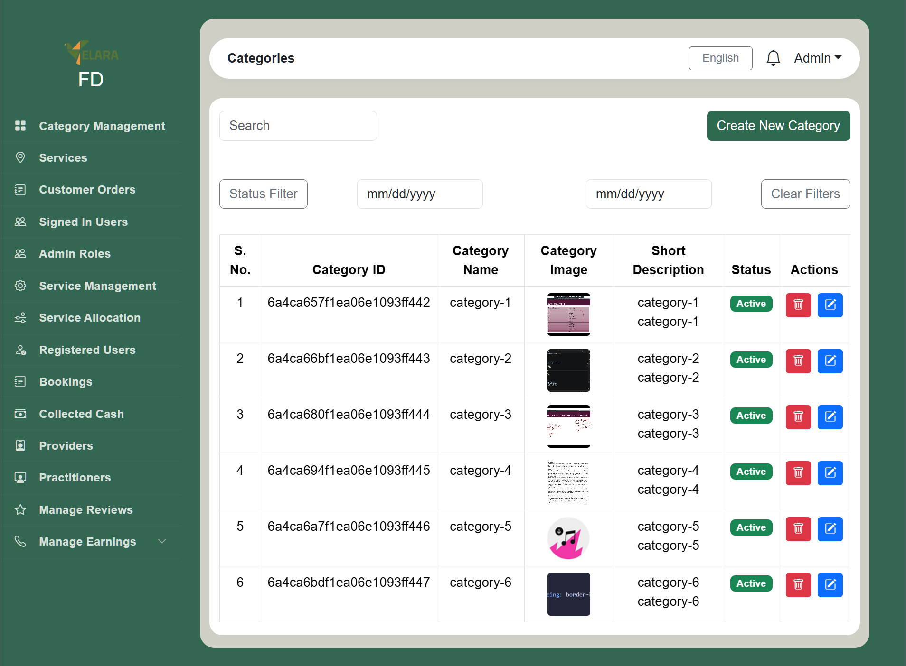
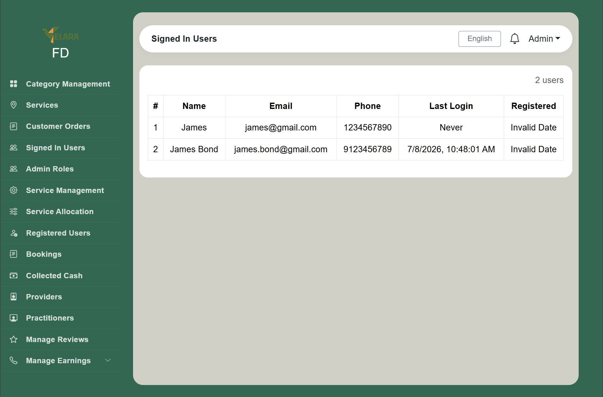
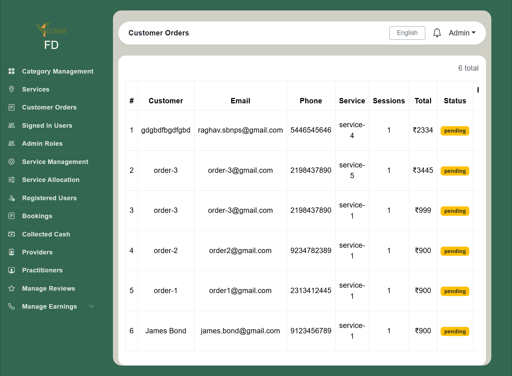
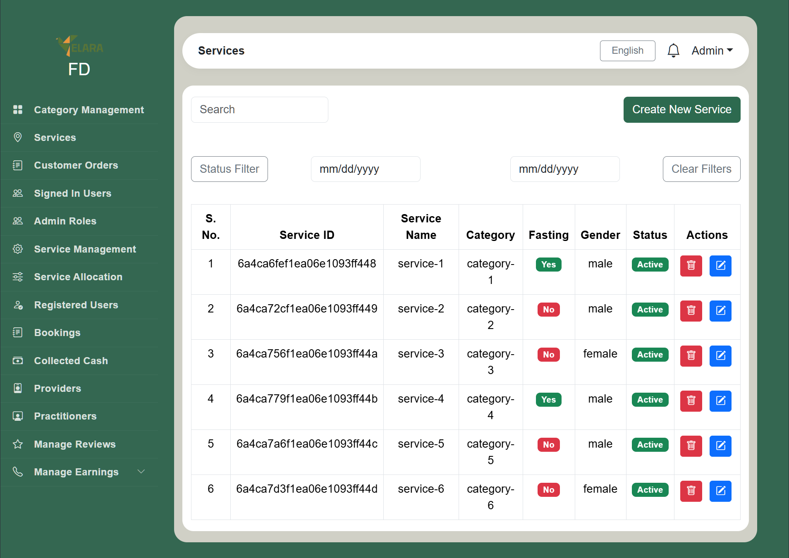

# Trustelara MERN Internship Project

A full-stack service marketplace web application developed during the **MNIT MIIC Full Stack MERN Internship Program** under the guidance of **Alphonic**.

This project was built to gain practical experience in full-stack web development using the **MERN Stack**. It features separate customer and admin panels, a RESTful backend, and MongoDB database integration for dynamic data management.

> **Note:** This project was developed for educational and internship purposes as part of the MNIT MIIC internship program. It is an implementation created during the internship and is **not the official Trustelara website**.

---

# Project Overview

The application consists of three major modules:

- **Customer Frontend** – Users can browse services, view categories, add services to their cart, and complete the checkout process.
- **Admin Frontend** – Administrators can manage categories, services, customers, and orders through a dedicated dashboard.
- **Backend** – Handles REST APIs, authentication, business logic, and communication with the MongoDB database.

The project follows a modular architecture, separating frontend and backend code for better scalability and maintainability.

---

# Features

## Customer Panel

- Responsive user interface
- Browse service categories
- View service details
- Add services to cart
- Checkout functionality
- Dynamic data fetched from backend APIs

---

## Admin Panel

- Dashboard for administrators
- Manage categories
- Manage services
- View customer information
- Manage customer orders
- Dynamic CRUD operations

---

## Backend

- Node.js & Express.js server
- RESTful API development
- Middleware implementation
- Controller-based architecture
- MongoDB integration using Mongoose
- Error handling
- Environment variable configuration

---

## Database

- MongoDB database
- Mongoose schemas and models
- Dynamic data storage
- CRUD operations
- Database configuration through environment variables

---

# Tech Stack

## Frontend

- React.js
- Vite
- JavaScript (ES6+)
- HTML5
- CSS3

## Backend

- Node.js
- Express.js

## Database

- MongoDB
- Mongoose

## Development Tools

- Git
- GitHub
- VS Code
- Postman
- npm

---

# Repository Structure

```text
Trustelara-MERN-Internship-Project
│
├── README.md
├── .gitignore
│
├── screenshots
│
├── customer-frontend
│   ├── public
│   ├── src
│   │   ├── assets
│   │   ├── components
│   │   ├── pages
│   │   ├── services
│   │   ├── App.jsx
│   │   └── main.jsx
│   └── package.json
│
├── admin-frontend
│   ├── public
│   ├── src
│   │   ├── assets
│   │   ├── components
│   │   ├── pages
│   │   ├── services
│   │   ├── App.jsx
│   │   └── main.jsx
│   └── package.json
│
└── backend
    ├── config
    ├── controllers
    ├── middleware
    ├── models
    ├── routes
    ├── seed
    ├── utils
    ├── server.js
    └── package.json
```

---

# Screenshots

## Customer Homepage


---

## Service Categories



---

## Services Page



---

## Service Details



---

## Shopping Cart



---

## Checkout



---

## Admin Dashboard - Categories



---

## Admin Dashboard - Customers



---

## Admin Dashboard - Orders



---

## Admin Dashboard - Services



---

# Getting Started

## Clone the Repository

```bash
git clone https://github.com/your-username/Trustelara-MERN-Internship-Project.git
```

---

# Customer Frontend

```bash
cd customer-frontend

npm install

npm run dev
```

---

# Admin Frontend

```bash
cd admin-frontend

npm install

npm run dev
```

---

# Backend

```bash
cd backend

npm install

npm start
```

---

# Environment Variables

Create a `.env` file inside the **backend** folder.

Example:

```env
PORT=5000

MONGO_URI=your_mongodb_connection_string

JWT_SECRET=your_secret_key
```

---

# Database

The project uses **MongoDB** with **Mongoose** for data management.

Database implementation includes:

- Database configuration
- Schema creation
- Model relationships
- Dynamic CRUD operations
- REST API integration

Sample data can be initialized using the files inside the **seed** directory if required.

---

# What I Learned

During this internship project, I gained hands-on experience with:

- Building full-stack MERN applications
- React component architecture
- State management
- REST API development
- Express.js routing
- MongoDB & Mongoose
- Backend controllers and middleware
- Dynamic database integration
- Git & GitHub workflow
- Project structuring and organization

---

# Future Improvements

- Deploy the application online
- Implement advanced authentication
- Improve performance and optimization
- Add search and filtering
- Enhance UI/UX
- Add automated testing

---

# Internship Information

**Program:** MNIT MIIC Full Stack MERN Internship

**Guided By:** Alphonic

**Technology Stack:** MERN (MongoDB, Express.js, React.js, Node.js)

---

# Author

**Arya Sharma**

B.Tech CSE (Artificial Intelligence)  
Birla Institute of Technology, Mesra

GitHub: https://github.com/arya-sharma-dev

---

## If you found this project helpful, consider giving it a ⭐ on GitHub!
